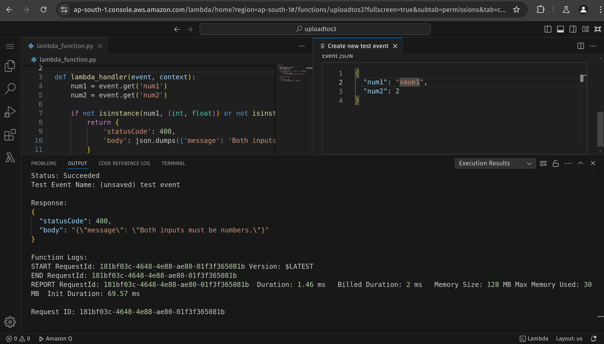
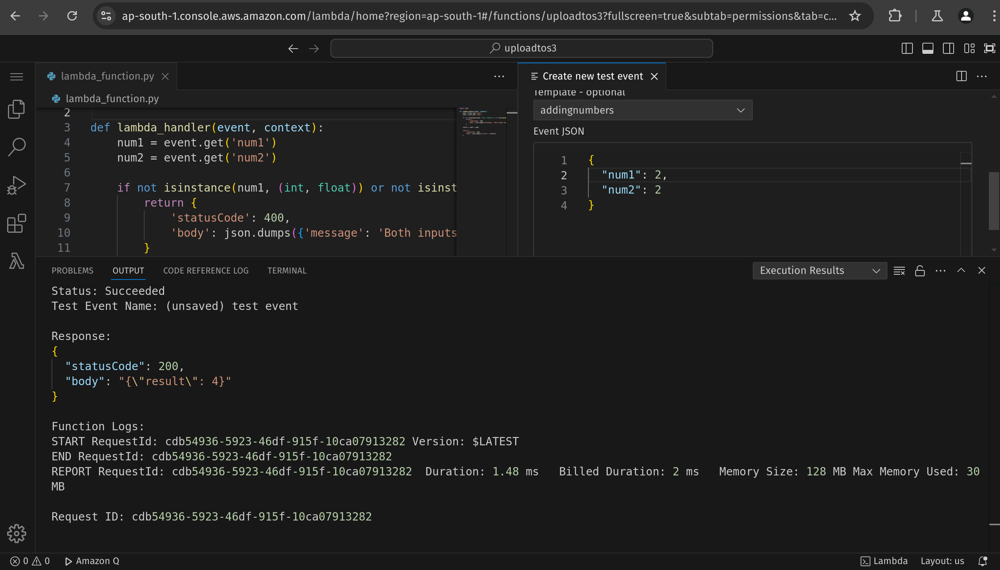
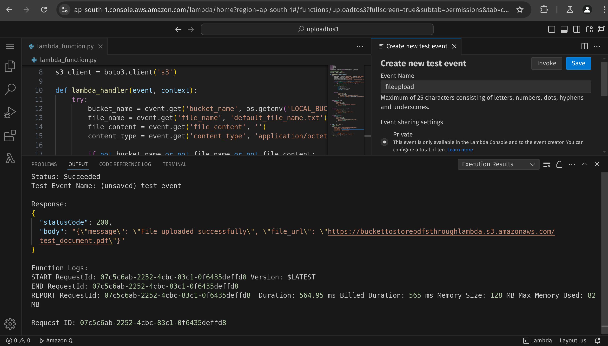
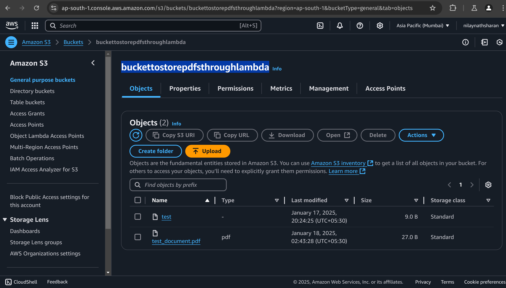

# AWS Lambda Functions

This repository contains two AWS Lambda functions:

1. **Add Two Numbers**: Adds two numbers and returns the result.
2. **Store Document in S3**: Uploads a document or PDF file to an Amazon S3 bucket.

---

## Setup Instructions

1. **Clone the Repository**:

   ```bash
   git clone <repository_url>
   cd <repository_name>
   ```

2. **Install Dependencies**:

   ```bash
   pip install -r requirements.txt
   ```

3. **Configure AWS CLI**:

   ```bash
   aws configure
   ```

   Enter your `AWS Access Key ID`, `AWS Secret Access Key`, region, and preferred output format.

4. **Deploy the Lambda Functions**:

   Use the AWS CLI or the AWS Management Console.

---

## Function 1: Add Two Numbers

### Description

This function takes two numbers as input, adds them, and returns the result.

### Code

```python
import json
from typing import Union

def lambda_handler(event, context):
    num1 = event.get('num1')
    num2 = event.get('num2')

    if not isinstance(num1, (int, float)) or not isinstance(num2, (int, float)):
        return {
            'statusCode': 400,
            'body': json.dumps({'message': 'Both inputs must be numbers.'})
        }

    result = _calculate(num1, num2)

    return {
        'statusCode': 200,
        'body': json.dumps({'result': result})
    }

def _calculate(number1: Union[int, float], number2: Union[int, float]) -> Union[int, float]:
    return number1 + number2
```

### Sample Input

```json
{
  "num1": 5,
  "num2": 10
}
```

### Sample Output

#### Unsuccessful Output



#### Successful Output



---

## Function 2: Store Document in S3

### Description

This function uploads a provided document or PDF file to an S3 bucket.

### Prerequisites

- Create an S3 bucket in your AWS account.
- Update the bucket name in the code.
- Assign the required S3 access permissions to the Lambda function by creating a user group with the necessary S3 permissions.

### Code

```python
import json
import boto3
import base64
from botocore.exceptions import BotoCoreError, ClientError

s3_client = boto3.client('s3')

def lambda_handler(event, context):
    try:
        bucket_name = event.get('bucket_name', 'buckettostorepdfsthroughlambda')
        file_name = event.get('file_name')
        file_content = event.get('file_content')
        content_type = event.get('content_type', 'application/octet-stream')

        if not bucket_name or not file_name or not file_content:
            raise KeyError("One or more required parameters are missing: 'bucket_name', 'file_name', 'file_content'.")

        decoded_file_content = base64.b64decode(file_content)

        # Upload the file to S3
        s3_client.put_object(
            Bucket=bucket_name,
            Key=file_name,
            Body=decoded_file_content,
            ContentType=content_type
        )

        return {
            "statusCode": 200,
            "body": json.dumps({
                "message": "File uploaded successfully",
                "file_url": f"https://{bucket_name}.s3.amazonaws.com/{file_name}"
            })
        }

    except KeyError as e:
        return {
            "statusCode": 400,
            "body": json.dumps({
                "error": "Missing required parameter",
                "details": str(e)
            })
        }
    except (BotoCoreError, ClientError) as e:
        return {
            "statusCode": 500,
            "body": json.dumps({
                "error": "Failed to upload file",
                "details": str(e)
            })
        }
    except Exception as e:
        return {
            "statusCode": 500,
            "body": json.dumps({
                "error": "An unexpected error occurred",
                "details": str(e)
            })
        }
```

### Sample Input

```json
{
  "bucket_name": "buckettostorepdfsthroughlambda",
  "file_name": "hello.pdf",
  "content_type": "application/pdf",
  "file_content": "<Base64_encoded_content>"
}
```

### Sample Output

- **Response from AWS Console**:  
  

- **File Stored in S3**:  
  
