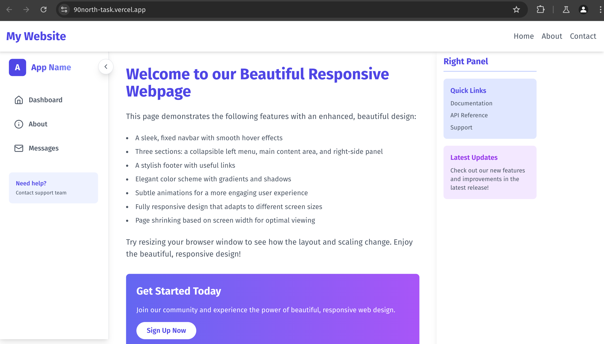

# Fullstack Assignment - Software Development Engineering (Web) internship

## Introduction

Welcome to the Fullstack Project for the Internship Challenge. This project includes the following components:

- **Frontend Development**: A responsive webpage with a fixed navbar, collapsible left menu, and dynamic resizing based on screen width.
- **Django Chat Application**: A real-time chat application with user authentication, message storage, and WebSocket integration.
- **AWS Lambda Functions**: Serverless functions for adding numbers and storing files in an S3 bucket.

Each part of the project is structured as a separate module. Below are the individual components, each with its own set of tasks and features.

## Project Structure

1. **Frontend Development**

   - Responsive Webpage Design
   - Navbar, Left Menu, Main Content Area, and Right Panel
   - Dynamic Resizing based on Screen Width

   

   - Hosted Link: [website](https://90north-task.vercel.app/) 
**Note**: The responsiveness may appear slightly off due to specific values for screen width mentioned in the problem statement.

   For further details, please refer to the [Frontend README](frontend/README.md).

2. **Django Chat Application**

   - User Sign-Up and Login
   - Collapsible Left Menu to Display Users
   - Chat Interface with WebSocket Integration for Real-Time Messaging

    

   For further details, please refer to the [Django Chat Application README](django-chat/README.md).

3. **AWS Lambda Functions**

   - Lambda Function to Add Two Numbers
   - Lambda Function to Store Files in an S3 Bucket

   For further details, please refer to the [AWS Lambda Functions README](aws-lambda/README.md).

    

## Installation and Setup

### Steps to Run the Project

1. **Clone the repository**:

   ```bash
   git clone https://github.com/yourusername/fullstack-project.git
   cd fullstack-project
   ```

2. **Navigate to respective projects**:

   ```bash
   cd north90<respective_project>
   ```

