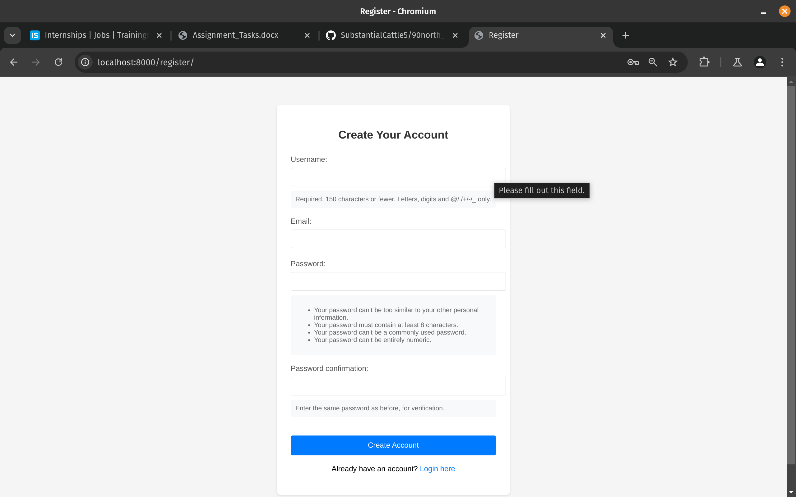
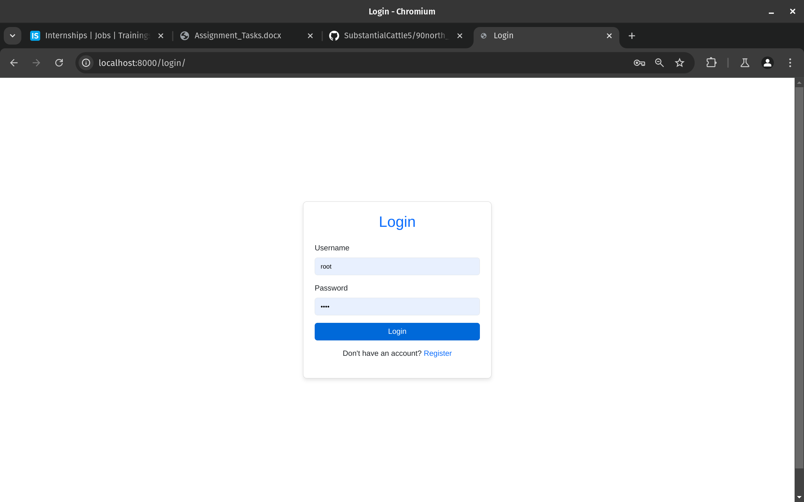
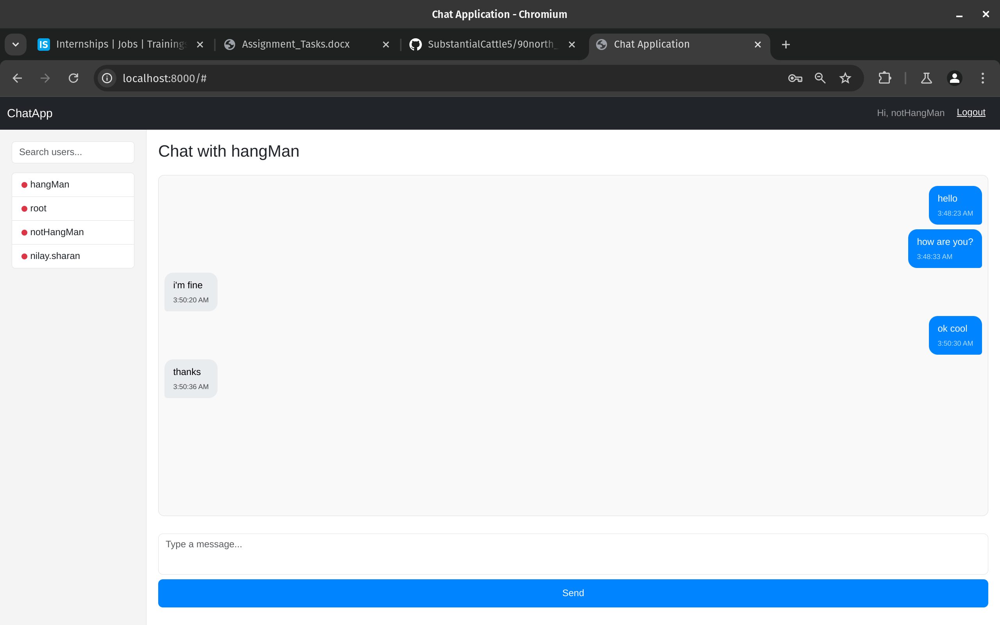

# Chat Application
This is a simple chat application built using Django and WebSockets. The application allows users to sign up, log in, and initiate chats with other users. The chat interface is user-friendly and supports the retrieval and display of previous messages.

## Features

- **User Authentication**: Users can sign up and log in.
- **User List**: Displays all registered users in a collapsible left menu.
- **Chat Initiation**: Users can select a contact from the menu to initiate a chat.
- **Message History**: Displays old messages when a chat is opened.
- **WebSocket Integration**: The chat uses WebSockets for real-time communication.
- **User-friendly Interface**: A responsive and easy-to-use chat interface.

## Technologies Used

- **Django**: Web framework for building the application.
- **Channels**: For WebSocket functionality and real-time chat updates.
- **SQLite/PostgreSQL**: Database for storing user data and messages.
- **HTML/CSS/JavaScript**: For frontend user interface.
- **Bootstrap**: For styling the chat interface.

## Installation and Setup

### Prerequisites

- Python 3.x
- Django 3.x+
- Django Channels
- WebSocket support in the browser

### Steps to Run the Project

1. **Clone the repository**:

   ```bash
   git clone <project-url>
   cd north90backend
   ```

2. **Create and activate a virtual environment** (optional but recommended):

   ```bash
   python3 -m venv env
   source env/bin/activate  # On Windows: env\Scripts\activate
   ```

3. **Install dependencies**:

   ```bash
   pip install -r requirements.txt
   ```

4. **Run the docker compose file for redis server (websocket)** 

    ```bash
    docker compose up 
    ```
4. **Apply database migrations**:

   ```bash
   python manage.py migrate
   ```

5. **Run the development server**:

   ```bash
   python manage.py runserver
   ```

6. **Access the application**:

   Open your browser and go to [http://localhost:8000](http://localhost:8000) to start using the chat application.

## Screenshots

### 1. Sign-Up Page


### 2. Login Page


### 3. Chat Interface



## Chat Functionality

- Users can log in to the chat application.
- Once logged in, a collapsible left menu will display all registered users.
- The logged-in user can click on any contact to start a chat. All previous messages will be displayed in the chat interface.
- The chat updates in real-time using WebSockets.

## Code Structure

```
.
├── chat
│   ├── apps.py
│   ├── comsumer.py
│   ├── forms.py
│   ├── __init__.py
│   ├── migrations
│   │   ├── 0001_initial.py
│   │   ├── 0002_rename_content_message_message.py
│   │   ├── __init__.py
│   │   └── __pycache__
│   │       ├── 0001_initial.cpython-310.pyc
│   │       ├── 0002_rename_content_message_message.cpython-310.pyc
│   │       └── __init__.cpython-310.pyc
│   ├── models.py
│   ├── __pycache__
│   │   ├── apps.cpython-310.pyc
│   │   ├── comsumer.cpython-310.pyc
│   │   ├── forms.cpython-310.pyc
│   │   ├── __init__.cpython-310.pyc
│   │   ├── models.cpython-310.pyc
│   │   ├── routing.cpython-310.pyc
│   │   ├── urls.cpython-310.pyc
│   │   └── views.cpython-310.pyc
│   ├── routing.py
│   ├── templates
│   │   └── chat
│   │       ├── chat.html
│   │       ├── login.html
│   │       └── register.html
│   ├── urls.py
│   └── views.py
├── db.sqlite3
├── docker-compose.yml
├── manage.py
├── media
│   ├── chat.png
│   ├── login.png
│   └── register.png
├── north90backend
│   ├── asgi.py
│   ├── __init__.py
│   ├── __pycache__
│   │   ├── asgi.cpython-310.pyc
│   │   ├── __init__.cpython-310.pyc
│   │   ├── settings.cpython-310.pyc
│   │   ├── urls.cpython-310.pyc
│   │   └── wsgi.cpython-310.pyc
│   ├── settings.py
│   ├── urls.py
│   └── wsgi.py
├── README.md
├── requirements.txt
└── templates
```

