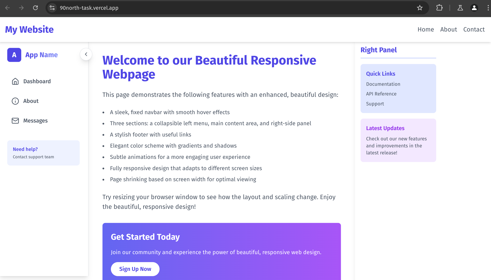

# Responsive Webpage with Next.js

This project is a responsive webpage built using Next.js, implementing the following features:

## Features

### Layout
1. **Fixed Navbar**: A navigation bar that remains fixed at the top of the viewport during scrolling.
2. **Three Sections Below the Navbar**:
   - **Left Menu**: A collapsible menu on the left side of the page.
   - **Main Content Area**: A central area for displaying content.
   - **Right-side Panel**: A panel on the right for additional information or widgets.
3. **Footer**: A footer section at the bottom of the webpage.

### Responsiveness
A JavaScript hook was created to dynamically adjusts the page width based on the screen size:

- **Screen Width Between 992px and 1600px**: The page shrinks to 90% of its width.
- **Screen Width Between 700px and 767px**: The page shrinks to 80% of its width.
- **Screen Width Between 600px and 700px**: The page shrinks to 75% of its width.
- **Screen Width Less Than or Equal to 600px**: The page shrinks to 50% of its width.

## Challenges with Responsiveness
The specified shrinkage percentages can create issues with responsiveness:

1. **Overlapping Elements**: The shrinking might cause elements to overlap, especially if the content or components have fixed widths or margins.
2. **Text Overflow**: Text in sections like the navbar, main content, or panels may overflow or get cut off.
3. **Unpredictable Behavior on Mid-range Screens**: The large gaps between defined ranges (e.g., 767px to 700px) may lead to unpredictable rendering for screens just outside these thresholds.
4. **Overall Layout Distortion**: Shrinking percentages do not account for padding, margins, or container-specific styles, which can distort the layout.

## How to Run the Project

1. **Clone the Repository**:
   ```bash
   git clone <repository-url>
   cd <repository-folder>
   ```

2. **Install Dependencies**:
   ```bash
   npm install
   ```

3. **Start the Development Server**:
   ```bash
   npm run dev
   ```

4. Open your browser and navigate to `http://localhost:3000`.


## Example Media 
